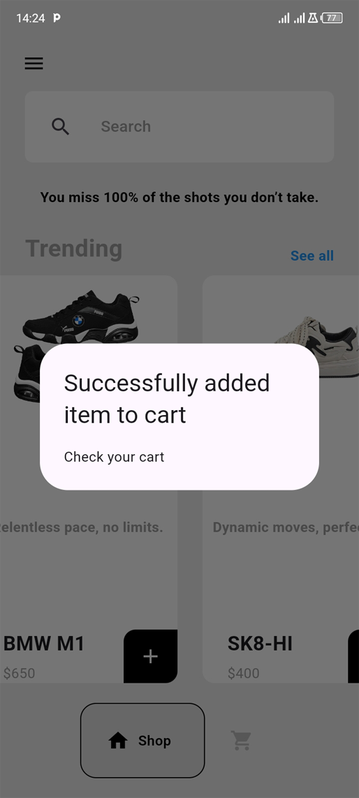

# Sneaker Sphere App Documentation
## Overview

Sneaker Sphere is a Flutter application that offers a seamless shopping experience for sneaker enthusiasts. This documentation provides an overview of the app's structure, features, and components.

## Table of Contents
1. **Getting Started**
2. **Architecture**
3. **Key Components**
4. **Demo Video and Screenshots**
5. **User Interface**
6. **Data Management**
7. **Contributing**
8. **License**

## Getting Started

### Prerequisites

- Flutter SDK
- Dart
- Android Studio or Visual Studio Code

# Installation
```
git clone https://github.com/SolomonB127/SneakerSphere.git
cd sneaker_sphere
flutter pub get
flutter run 
```

# Architecture
The app uses the Provider package for state management and follows a modular approach with separate pages and components.

## Key Components

### `main.dart`

-  Initializes the application.
-  Uses ChangeNotifierProvider to manage state with Cart.

### `welcome_page.dart`

- Displays the welcome screen.
- Includes a logo, title, and "Shop Now" button.

### `bottom_bar.dart`

-Provides navigation between different sections of the app.

### `shop_page.dart`

- Displays a list of trending shoes.
- Includes a search bar and shoe tiles.

### `shoe_tile.dart`

- Represents individual shoe items.
- Allows adding shoes to the cart.

### `cart_item.dart`

- Displays items in the cart.
- Allows removing items from the cart.

### `cart_data.dart`

- Manages the list of shoes for sale and in the cart.
- Handles adding and removing items.

# Demo Video and Screenshots

- **Demo Video:** A walkthrough of the app showcasing navigation and features. 
[Watch the demo video](./lib/assets/video/SneakerSphere_demo.mp4)

- **Screenshots:** Include images of the Welcome Page, 

  *Screenshot showing the Welcome Page*

Shop Page, 

  *Screenshot showing the Side Menu*


  *Screenshot showing the Products*


  *Screenshot showing the Products*


  *Screenshot showing Products being added to Cart*

and Cart Page.

  *Screenshot showing Products in Cart Page*

## User Interface
The app features a clean and modern design with intuitive navigation. Key UI elements include:

- **Logo and Branding:** Featured prominently on the Welcome Page.
- **Shop Now Button:** Encourages users to explore products.
- **Search Bar:** Allows users to search for specific items.
- **Shoe Tiles:** Visually appealing representation of products.
- **Cart Management:** Easy addition and removal of items.

## Data Management

- **Provider Pattern:** Utilized for state management.
- **Shoe Data:** Defined in Shoe class with properties like name, price, and description.
- **Cart Operations:** Managed by the Cart class, which notifies listeners of changes.

## Contributing
Contributions are welcome! Please follow these steps:

1. Fork the repository.
2. Create a new branch.
3. Make your changes.
4. Submit a pull request.

## License
This project is licensed under the MIT License. See the LICENSE file for details.